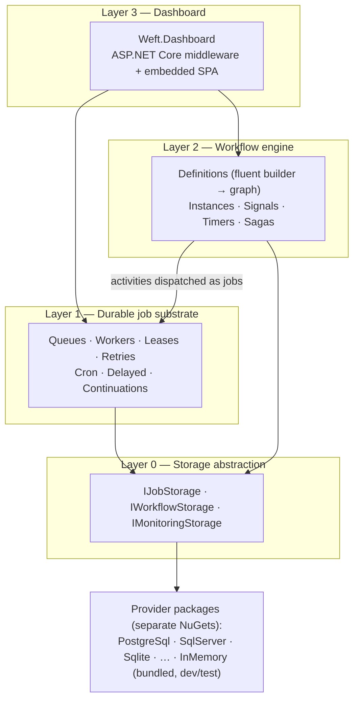

# Weft — Architecture

> **Status:** Accepted v1.0 — 2026-07-23. All open questions resolved; see §11 (decision log).
> **Name:** **Weft** (the thread woven across the warp, turning threads — jobs — into fabric — workflows). Confirmed; NuGet ID verified available 2026-07-23.

A durable job and workflow orchestration library for .NET. In-process, storage-agnostic, dashboard-included. The mental model: **Hangfire's substrate with a real orchestration layer on top.**

---

## 1. Vision

One library, four layers, each independently useful:

1. A **durable job substrate** — persistent queues, retries, cron, continuations (replaces Hangfire).
2. A **workflow engine** — code-first graphs with sagas, signals, timers, compensation (replaces WorkflowCore, competes with the non-designer half of Elsa).
3. An **ops dashboard** — mounted as middleware, zero extra deployment (Hangfire-style).
4. Storage as a **pure plugin** — the consumer decides which database; the core ships with none.

### Why it should exist

| | Jobs | Sagas/workflows | Dashboard | Infra required | Notes |
|---|---|---|---|---|---|
| Hangfire | ✅ | ⚠️ continuations only; batches paywalled | ✅ | none | orchestration is not a goal |
| WorkflowCore | ⚠️ | ✅ | ❌ | none | netstandard2.0-era, polling, low maintenance |
| Elsa 3 | ⚠️ | ✅ | ✅ + designer | none | heavy; designer-first philosophy |
| Temporal / Dapr | ✅ | ✅ | ✅ | server / sidecar | operational burden |
| **Weft** | ✅ | ✅ | ✅ | none | in-process, storage-pluggable, MIT |

The gap: nothing modern occupies *"in-process, one NuGet away, jobs + sagas in one coherent model."*

## 2. Goals and non-goals

**Goals**

- G1. Jobs and workflows share one substrate, one storage session, one dashboard.
- G2. Core package has **zero database dependencies**. Storage providers are separate NuGet packages; anyone can author one and verify it with the shipped conformance kit.
- G3. Hangfire-grade ergonomics for the simple case: one line to enqueue a job.
- G4. Correctness by construction: at-least-once execution, exactly-once *state transitions*, first-class idempotency keys.
- G5. Multi-node scale-out with no coordinator: lease-based claiming, any node can run any role.
- G6. Modern .NET only: `net10.0`, C# 14, `System.Text.Json`, `TimeProvider`, `IHostedService`, OpenTelemetry-native.
- G7. **Self-sufficient core.** No application-framework dependencies — not ABP, not MassTransit, not MediatR. Only the BCL and `Microsoft.Extensions.*` abstractions (DI, hosting, options, logging). Capabilities an app framework would otherwise contribute — multi-tenant context, correlation flow, authorization hooks — are implemented natively in Weft (§8).

**Non-goals (for now)**

- N1. Visual designer — deferred to post-1.0 (the graph model is designed so a designer can be added without re-architecture).
- N2. Temporal-style deterministic replay — we checkpoint state after every activity instead (see §7.2).
- N3. Human-task/user-management framework — signals + bookmarks are the primitive; approval UIs are the consumer's domain.
- N4. Framework integrations (ABP, MassTransit, …) — ruled out entirely (§11.7). Weft never takes a dependency on an application framework; whatever it needs from that world (tenancy, audit history, authorization) is built natively in core. Third parties are free to write adapters; we neither ship nor depend on any.

## 3. Architecture overview



The load-bearing idea: **every workflow activity execution is a Layer 1 job.** Retries, backoff, leases, distribution, and dashboard visibility are inherited by the workflow engine, never reimplemented.

## 4. Layer 0 — Storage provider model

The centerpiece, per the plugin decision. Design principles:

- **P1. Core is storage-blind.** `Weft` (core) references no database client. Providers live in `Weft.Storage.<Tech>` packages.
- **P2. Small surface, strong contract.** Providers implement a handful of operations but must honor strict atomicity guarantees (§4.2). Everything clever (state machines, retry math, cron) lives in the engine, not the provider.
- **P3. Capability discovery, graceful fallback.** Optional powers (push notifications, batch claim) are advertised; the engine adapts (e.g. falls back to adaptive polling).
- **P4. Verifiable by third parties.** `Weft.Storage.Verification` ships xUnit conformance suites (a TCK) that hammer contention, atomicity, and lease semantics. A provider that passes is a supported provider.
- **P5. InMemory bundled in core** — for dev, samples, and unit tests. Explicitly not durable.

### 4.1 Interfaces (sketch)

```csharp
public interface IJobStorage
{
    StorageCapabilities Capabilities { get; }

    // Hot path
    ValueTask EnqueueAsync(IReadOnlyList<JobRecord> jobs, CancellationToken ct);
    ValueTask<IReadOnlyList<JobRecord>> ClaimAsync(ClaimRequest request, CancellationToken ct);
    ValueTask RenewLeasesAsync(string workerId, IReadOnlyList<JobId> jobs, TimeSpan lease, CancellationToken ct);
    ValueTask ApplyAsync(JobTransition transition, CancellationToken ct);

    // Scheduling
    ValueTask<int> ActivateDueJobsAsync(DateTimeOffset now, int batchSize, CancellationToken ct);
    ValueTask UpsertRecurringAsync(RecurringJobRecord record, CancellationToken ct);
    ValueTask<IReadOnlyList<RecurringJobRecord>> ClaimDueRecurringAsync(DateTimeOffset now, CancellationToken ct);
}

public interface IWorkflowStorage
{
    ValueTask CreateInstanceAsync(WorkflowInstanceRecord instance, CancellationToken ct);
    ValueTask<WorkflowInstanceRecord?> GetInstanceAsync(WorkflowInstanceId id, CancellationToken ct);
    /// Optimistic concurrency: fails with VersionConflict unless expectedRevision matches.
    ValueTask UpdateInstanceAsync(WorkflowInstanceRecord instance, long expectedRevision, CancellationToken ct);

    ValueTask AddBookmarkAsync(BookmarkRecord bookmark, CancellationToken ct);
    /// Atomically consumes exactly one matching bookmark (signal delivery), or none.
    ValueTask<BookmarkRecord?> ConsumeBookmarkAsync(string signalName, string correlationId, CancellationToken ct);
}

/// Optional. Providers with a push mechanism (e.g. Postgres LISTEN/NOTIFY) implement this;
/// otherwise workers use adaptive polling.
public interface IStorageNotifier
{
    IAsyncEnumerable<QueueSignal> ListenAsync(IReadOnlySet<string> queues, CancellationToken ct);
}

/// Read model for the dashboard — deliberately separate so the hot path stays lean.
public interface IMonitoringStorage
{
    ValueTask<JobStatistics> GetStatisticsAsync(CancellationToken ct);
    ValueTask<Page<JobSummary>> QueryJobsAsync(JobQuery query, CancellationToken ct);
    ValueTask<Page<WorkflowInstanceSummary>> QueryInstancesAsync(InstanceQuery query, CancellationToken ct);
    ValueTask<JobDetails?> GetJobAsync(JobId id, CancellationToken ct);
}
```

`JobTransition` is a small command object computed by the *engine* (target state + atomic side effects: enqueue these continuations / schedule this retry / dead-letter). The provider's only duty is to apply it **atomically**. This keeps retry policy, backoff math, and continuation logic out of every provider.

### 4.2 Atomicity contract (what the conformance kit enforces)

1. **Claim is exclusive.** Two concurrent `ClaimAsync` calls never return the same job. Relational providers use native queue semantics (`FOR UPDATE SKIP LOCKED` / `READPAST`); others use compare-and-set.
2. **Claim sets a lease.** A claimed job invisible to others until `LeaseUntil`; expired leases make the job claimable again (worker-crash recovery).
3. **`ApplyAsync` is all-or-nothing.** State change + side effects commit together or not at all.
4. **`ConsumeBookmarkAsync` consumes at most once** under arbitrary concurrency (a signal resumes exactly one waiting instance).
5. **`ClaimDueRecurringAsync` fences.** A due recurring job fires on exactly one node (compare-and-set on `NextFireTime`).
6. **Idempotency keys are unique.** Enqueue with a duplicate active idempotency key is a no-op returning the existing job.

### 4.3 Provider roadmap

Reference providers are authored by us in separate packages, in this order of *intent* (final order = open question §12): PostgreSQL (best DB-as-queue semantics + LISTEN/NOTIFY), SQL Server, SQLite (dev/small deployments). Community providers (Mongo, Redis, …) become viable the day the conformance kit ships.

## 5. Layer 1 — Durable job substrate

### 5.1 Job model

```
        ┌────────── retry (delay elapsed) ──────────┐
        ▼                                           │
Scheduled ──due──► Enqueued ──claim──► Processing ──┼──► Succeeded
                      ▲                    │        │
                      └── lease expired ───┤        └──► Failed ──► Dead (retries exhausted)
                                           └──────────► Cancelled
```

`JobRecord`: id, queue, serialized invocation, state, priority, due time, lease (`WorkerId`, `LeaseUntil`), attempt count, retry policy, idempotency key, optional tenant id (§8), correlation (workflow instance/activity, if any), timestamps.

### 5.2 Public API (Hangfire-grade ergonomics)

```csharp
// Fire-and-forget — expression captured, args serialized, target resolved from DI at execution
await jobs.EnqueueAsync<IEmailSender>(s => s.SendAsync(orderId));

// Delayed / scheduled
await jobs.ScheduleAsync<IReportService>(s => s.GenerateAsync(month), delay: TimeSpan.FromHours(2));

// Recurring (cron)
await jobs.UpsertRecurringAsync<ICleanupService>("purge-temp", "0 3 * * *", s => s.PurgeAsync());

// Continuation
await jobs.ContinueWithAsync<INotifier>(parentId, n => n.NotifyDoneAsync(orderId));

// Options: queue, priority, retry policy, idempotency key
await jobs.EnqueueAsync<IPayments>(p => p.CaptureAsync(paymentId),
    new EnqueueOptions { Queue = "payments", Retry = Retry.Exponential(5), IdempotencyKey = $"capture:{paymentId}" });
```

Invocation capture: expression tree → `{ declared type, method, serialized args }` via `System.Text.Json`. Instance methods only, target resolved from the consumer's DI container inside a scope. Method matching by name + parameter types; guidance: keep job signatures stable, pass IDs not entities.

### 5.3 Workers

- A worker pool per node (`IHostedService`), configurable queues + degree of parallelism.
- **Wakeup:** `IStorageNotifier` push when available, else adaptive polling (fast when busy, backing off to a ceiling when idle).
- **Leases + heartbeat:** claims take a lease (default 5 min); a heartbeat loop renews leases for in-flight jobs. Worker crash ⇒ lease expires ⇒ job reclaimed elsewhere. `CancellationToken` passed into every job; lease-lost ⇒ token fires (best-effort duplicate suppression).
- **Scheduler role:** every node opportunistically runs `ActivateDueJobsAsync` + `ClaimDueRecurringAsync`; both are atomic/fenced, so no leader election is needed.

### 5.4 Delivery semantics

- **Execution: at-least-once.** A job may run twice (crash after work, before ack). Consumers make handlers idempotent; idempotency keys + the docs make this a front-page concept, not fine print.
- **State transitions: exactly-once.** The atomic claim + `ApplyAsync` contract guarantees a job's lifecycle is linear even under concurrent workers.

## 6. Layer 2 — Workflow engine

### 6.1 Definitions: code-first fluent builder → serializable graph shape

```csharp
public sealed class InvoiceApproval : IWorkflow<InvoiceData>
{
    public string Id => "invoice-approval";
    public int Version => 2;

    public void Build(IWorkflowBuilder<InvoiceData> flow) => flow
        .StartWith<ValidateInvoice>()
        .If(d => d.Amount > 10_000, approved => approved
            .WaitForSignal<ManagerDecision>("manager-approval",
                correlate: d => d.InvoiceId,
                bind: (d, sig) => d.Approved = sig.IsApproved,
                timeout: TimeSpan.FromDays(7)))
        .Then<PostToErp>(step => step.OnError(Retry.Exponential(5)))
        .Saga(saga => saga
            .Then<ReserveStock>().CompensateWith<ReleaseStock>()
            .Then<ChargeCustomer>().CompensateWith<RefundCustomer>())
        .Parallel(
            branch => branch.Then<SendReceipt>(),
            branch => branch.Then<UpdateAnalytics>());
}

public sealed class PostToErp : IActivity<InvoiceData>
{
    private readonly IErpClient _erp;
    public PostToErp(IErpClient erp) => _erp = erp;                 // constructor DI

    public async Task ExecuteAsync(ActivityContext<InvoiceData> ctx, CancellationToken ct)
    {
        ctx.Data.ErpDocumentId = await _erp.PostAsync(ctx.Data.InvoiceId, ct);
    }
}
```

- Definitions are **registered code** (`services.AddWeft(w => w.AddWorkflow<InvoiceApproval>())`), like WorkflowCore — not serialized. The graph **shape** (nodes, edges, activity names, saga/parallel structure) exports to JSON: that's what the dashboard renders today and what a future designer edits (N1).
- **Versioning:** `(Id, Version)` keys a definition. In-flight instances always finish on the version they started with; new starts use the latest (or a pinned) version. Old versions stay registered until their instances drain.

### 6.2 Execution model: checkpointed graph, not replay

Deliberately **not** Temporal-style replay. Instead:

1. Starting an instance persists a `WorkflowInstanceRecord` (definition id+version, `TData` document, cursor positions) and enqueues the first activity **as a Layer 1 job**.
2. A worker claims the job, runs the activity (DI scope, mutates `ctx.Data`), and on completion the engine **checkpoints**: persists updated `TData` + advanced cursor via `UpdateInstanceAsync` (optimistic concurrency), and enqueues the next activity job(s) — atomically with the job's own transition.
3. Crash between activities ⇒ the activity job's lease expires and it re-runs. The activity is the unit of at-least-once; the checkpoint is the unit of exactly-once progress.

Consequences (documented rules, enforced where cheap):

- **Branch conditions must be pure** functions of `TData` (they may be re-evaluated after rehydration).
- **Parallel branches should write disjoint regions** of `TData`; each branch checkpoint merges under optimistic concurrency, conflicts retry the merge, not the activity.
- No determinism constraints on activities themselves — they're ordinary code.

### 6.3 Signals, bookmarks, timers

- `WaitForSignal<TPayload>(name, correlate, bind, timeout?)` suspends the instance: a `BookmarkRecord` (signal name + correlation id + payload type) is stored; **no job exists while waiting** — a suspended workflow costs nothing.
- **Signals are strongly typed** (decision §11.5): the definition declares `TPayload` and a binder `(data, payload) => …`; the sender calls the matching typed overload — shape mismatches are compile-time errors. The wire/storage format is plain JSON (STJ), so external senders (webhooks, other languages) can still post raw JSON that deserializes into `TPayload`; a loose `JsonElement` overload exists as the escape hatch.
- Delivery: `await workflows.SignalAsync("manager-approval", correlationId, new ManagerDecision { IsApproved = true })` → `ConsumeBookmarkAsync` (atomic, at-most-once) → resume job enqueued, binder applies the payload to `TData` at resume.
- **Timers = delayed jobs.** `Delay(...)`, signal timeouts, and `Schedule/Recur` nodes all compile to Layer 1 scheduled jobs carrying a resume token — one mechanism, already durable.

### 6.4 Sagas and compensation

- `Saga(...)` blocks record completed steps in instance state. On failure past retry policy, the engine runs registered `CompensateWith<T>` activities in reverse order — each compensation is itself a durable job with its own retry policy.
- Per-step error policy: `Retry` (default), `Compensate` (trigger saga unwind), `Suspend` (park for operator action — visible in dashboard), `Terminate`.

### 6.5 Cancellation

`workflows.CancelAsync(instanceId)`: marks the instance, cancels outstanding jobs cooperatively, and — inside a saga — triggers compensation. Terminal states: `Completed`, `Failed`, `Compensated`, `Cancelled`.

## 7. Layer 3 — Dashboard

**Contract-first, three official UIs** (decision §11.4).

- `Weft.Dashboard` is the backend: `app.MapWeftDashboard("/weft")` mounts a **versioned REST API with a published OpenAPI document** — reads through `IMonitoringStorage`, management actions through the engine (requeue, retry-now, cancel, resume-suspended, send-signal, trigger-recurring), authorization via `IWeftDashboardAuthorization`. Usable headless: the API *is* the product; any UI is a client.
- **Three official UI packages** — `Weft.Dashboard.Ui.React`, `Weft.Dashboard.Ui.Angular`, `Weft.Dashboard.Ui.Blazor` — each an embedded prebuilt bundle (no CDN; consumers never install Node). A consumer references the backend plus exactly one UI package.
- **Phased rollout, not lockstep**: React ships first as the reference implementation (0.2) while the API contract settles; Angular (0.5) and Blazor (1.0) follow, each targeting a frozen contract version. Feature parity is tracked against the OpenAPI version, so a feature is never designed three times — it's designed once in the contract and rendered three times.
- Feature stages: read-only first (stats overview, job lists by state, job detail with exception + attempt history, recurring schedule view, workflow instance list + **graph view with live cursor** — the exported shape from §6.1 pays off here); management actions second.

## 8. Cross-cutting

- **Serialization:** `System.Text.Json` throughout (args, `TData`, bookmarks). Polymorphism via STJ type discriminators; no `TypeNameHandling`-style CVE surface. Contracts: renaming types/methods used by in-flight jobs is a breaking deploy — documented, with an alias attribute (`[JobAlias]`) as the escape hatch.
- **Observability:** OpenTelemetry-native — `ActivitySource` spans per job/activity execution (trace context propagated from enqueue site to worker), `Meter` counters/histograms (queue depth, latency, attempts). Dashboard consumes the same counters.
- **Multi-tenancy (native, optional):** `JobRecord` and `WorkflowInstanceRecord` carry an optional `TenantId`. A pluggable `ITenantContextAccessor` captures the ambient tenant at enqueue/start; workers restore it into the execution scope before resolving the job's target, so consumer code (and its data filters) sees the right tenant. The dashboard API filters by tenant. Single-tenant apps pay nothing — the field stays null. Implemented in core with no framework dependency (G7).
- **Time:** all scheduling through `TimeProvider` — cron and lease logic unit-testable with `FakeTimeProvider`.
- **Testing:** conformance kit for providers (§4.4 P4); `Weft.Testing` for consumers (in-memory host, `AdvanceTime`, signal helpers, single-step execution).
- **Topology:** every node is identical (workers + opportunistic scheduler + optional dashboard). Scale-out = run more nodes against the same store. No leader, no coordinator.

## 9. Package layout

| Package | Contents |
|---|---|
| `Weft` | Abstractions + engine (Layers 0–2) + InMemory storage. Zero DB deps. |
| `Weft.Storage.PostgreSql` | First reference provider (§11.2) |
| `Weft.Storage.SqlServer` / `.Sqlite` | Further reference providers (separate packages, consumer's choice) |
| `Weft.Storage.Verification` | Provider conformance test kit (TCK) |
| `Weft.Dashboard` | Dashboard backend: REST API + OpenAPI contract, middleware |
| `Weft.Dashboard.Ui.React` / `.Ui.Angular` / `.Ui.Blazor` | Official UIs — embedded prebuilt bundles, pick one |
| `Weft.Testing` | Consumer test harness |

Target: `net10.0` only. C# 14, nullable enabled, trimming-annotated where feasible.

## 10. Roadmap

| Phase | Deliverable | Proves |
|---|---|---|
| **0.1** | Core abstractions, InMemory provider, substrate (enqueue/delayed/cron/continuations/retries/leases), conformance kit | The storage contract is right |
| **0.2** | PostgreSQL provider; dashboard REST API + OpenAPI contract; React UI (read-only) | Real-DB queue semantics; the API-first ops story |
| **0.3** | Workflow engine core: sequence/if/foreach/parallel, typed signals+bookmarks, timers | The jobs-as-activities bet |
| **0.4** | Sagas/compensation, versioning, dashboard management actions (contract + React) | Production orchestration |
| **0.5** | OpenTelemetry, SqlServer provider, batch enqueue, `Weft.Testing`, Angular UI | Breadth + the multi-UI model |
| **1.0** | Hardening, Blazor UI, docs site, benchmarks vs Hangfire/WorkflowCore | Credibility |
| post-1.0 | JSON/YAML DSL, visual designer over the exported graph shape | The N1 deferral pays off |

## 11. Decision log

All open questions resolved 2026-07-23:

1. **Name: Weft.** NuGet ID verified available (also checked: Skein/Strand/Warp/Chord/Reel available; Braid/Loom/Tandem/Lattice taken).
2. **First reference provider: PostgreSQL** — best DB-as-queue semantics (`SKIP LOCKED` + `LISTEN/NOTIFY`); the provider other authors copy from. SqlServer in 0.5, Sqlite after.
3. **License: MIT** — part of the positioning vs Hangfire Pro's paywalled features.
4. **Dashboard: three official UIs — React, Angular, Blazor** — over a single versioned REST + OpenAPI contract (§7). Phased: React (reference, 0.2) → Angular (0.5) → Blazor (1.0). Features are designed once in the contract, rendered three times.
5. **Signals: strongly typed** (`WaitForSignal<TPayload>` + typed `SignalAsync` overload); JSON wire format keeps webhook/external senders possible; loose `JsonElement` overload as escape hatch.
6. **Repo: mono-repo** (`src/`, `test/`, `samples/`, `docs/`), GitHub Actions CI, central package management, `net10.0` only. Scaffolded 2026-07-23.
7. **No application-framework dependencies — ABP explicitly ruled out.** Everything Weft needs that ABP would otherwise provide (multi-tenant context, audit/attempt history, authorization hooks) is implemented natively in core, on the BCL + `Microsoft.Extensions.*` only (G7, N4, §8 multi-tenancy).
8. **Phase 0.1 storage contract v1 (2026-07-24, red-teamed before implementation; normative text lives in the `IJobStorage`/`IWorkflowStorage` XML docs, enforced by the TCK).** Key refinements over the §4.1 sketch:
   - `Awaiting` state added for continuations. Activation is one level deep; **cancellation cascades through the transitive Awaiting-descendant closure** (an activated child shields its own subtree). Awaiting inserts fix up against already-terminal parents inside the same transaction and must serialize with the parent's terminal transition — no interleaving may strand a committed child in `Awaiting`.
   - **`Attempt` (claims started; fencing/poison only) is split from `Failures` (recorded failures; drives retry math)** — interruptions never consume retry budget. Transitions are fenced on `(WorkerId, Attempt)`; `ApplyAsync` returns whether the fence held. A fenced *release* transition (target `Enqueued`) returns interrupted jobs to the queue on graceful shutdown. Poison rule: `Attempt − Failures > InterruptionLimit` ⇒ `Dead` without executing.
   - **Recurring firing is a compare-and-set on `NextFireTime` that inserts the fired job in the same atomic operation** (`GetDueRecurringAsync` + `TryFireRecurringAsync` replace the sketch's `ClaimDueRecurringAsync`), strengthening §4.2.5 to exactly-once enqueue per occurrence. Missed occurrences are skipped, scheduling from now. UTC-only cron (own vixie-dialect parser; no external deps per G7).
   - **Idempotency keys are scoped `(TenantId, IdempotencyKey)` among active jobs** (null tenant is its own scope); release on terminal transition is a uniqueness-scope rule — the field is never cleared. Enqueue batches are all-or-nothing and linearize against concurrent terminal key release.
   - **Claim order: `Priority DESC`, then FIFO by enqueue completion order** (provider-local monotonic sequence, not the JobId), across the union of requested queues. Job ids are engine-minted UUIDv7, opaque to providers.
   - **Job cancellation storage surface frozen in 0.1** (`TryCancelAsync` + `CancelRequested`): pre-active states cancel atomically with cascade; `Processing` gets a cooperative flag surfaced through lease-renewal omission; the client-facing API still lands in 0.2.
   - **Providers take a `TimeProvider` and never read database time** — the TCK drives leases/due-times deterministically with a fake clock; the multi-node clock-skew envelope (`LeaseDuration > HeartbeatInterval + skew`, validated at startup) is an operating requirement, not conformance-testable.
   - Contract exceptions: `WeftConcurrencyException` (revision mismatch, missing instance, duplicate create), `WeftParentJobNotFoundException`; return values (not exceptions) signal expected multi-node race losses. `ConsumeBookmarkAsync` consumes the oldest match.
   - Worker shutdown is two-phase (drain with heartbeat, then abandon + release); job tokens are never linked to the host stop token. In-flight tracking is keyed `(JobId, Attempt)` so self-reclaim after lease expiry is well-defined.
9. **Workflow data/cursor documents are semantic JSON, not opaque bytes (2026-07-25).** Providers may store `DataJson`/`CursorJson` in native JSON columns (jsonb); the preservation contract is semantic equality — lexical formatting and object key order need not survive. Surfaced by the first PostgreSQL conformance run; the TCK asserts with `JsonNode.DeepEquals`.
