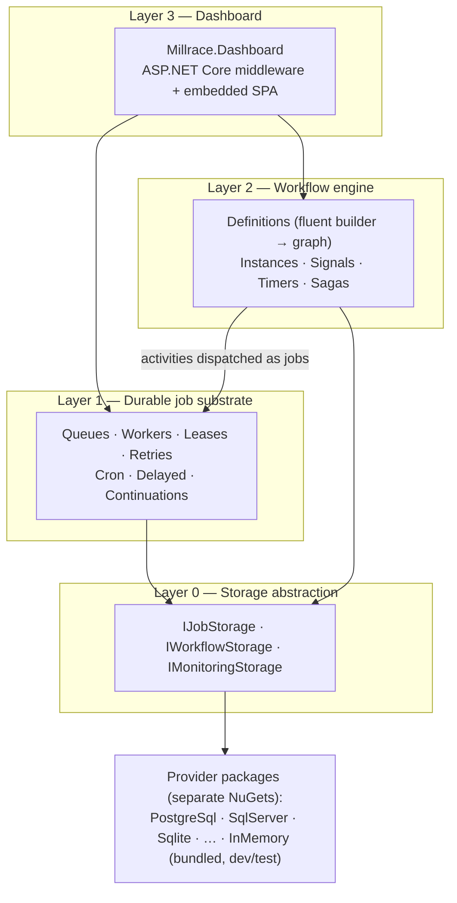

# Millrace — Architecture

> **Status:** Accepted v1.0 — 2026-07-23; renamed to Millrace 2026-07-25 (§11.10). All open questions resolved; see §11 (decision log).
> **Name:** **Millrace** (the engineered channel that carries water to the wheel — directed, sustained flow that does work). NuGet ID and the whole `Millrace.*` prefix verified unused 2026-07-25.

A durable job and workflow orchestration library for .NET. In-process, storage-agnostic, dashboard-included. The mental model: **Hangfire's substrate with a real orchestration layer on top.**

---

## 1. Vision

One library, four layers, each independently useful:

1. A **durable job substrate** — persistent queues, retries, cron, continuations (replaces Hangfire).
2. A **workflow engine** — code-first graphs with sagas, signals, timers, compensation (replaces WorkflowCore, competes with the non-designer half of Elsa).
3. An **ops dashboard** — mounted as middleware, zero extra deployment (Hangfire-style).
4. Storage as a **pure plugin** — the consumer decides which database; the core ships with none.

### Why it should exist

| | Jobs | Sagas/workflows | Dashboard | Infra required | Notes |
|---|---|---|---|---|---|
| Hangfire | ✅ | ⚠️ continuations only; batches paywalled | ✅ | none | orchestration is not a goal |
| WorkflowCore | ⚠️ | ✅ | ❌ | none | netstandard2.0-era, polling, low maintenance |
| Elsa 3 | ⚠️ | ✅ | ✅ + designer | none | heavy; designer-first philosophy |
| Temporal / Dapr | ✅ | ✅ | ✅ | server / sidecar | operational burden |
| **Millrace** | ✅ | ✅ | ✅ | none | in-process, storage-pluggable, MIT |

The gap: nothing modern occupies *"in-process, one NuGet away, jobs + sagas in one coherent model."*

## 2. Goals and non-goals

**Goals**

- G1. Jobs and workflows share one substrate, one storage session, one dashboard.
- G2. Core package has **zero database dependencies**. Storage providers are separate NuGet packages; anyone can author one and verify it with the shipped conformance kit.
- G3. Hangfire-grade ergonomics for the simple case: one line to enqueue a job.
- G4. Correctness by construction: at-least-once execution, exactly-once *state transitions*, first-class idempotency keys.
- G5. Multi-node scale-out with no coordinator: lease-based claiming, any node can run any role.
- G6. Modern .NET only: `net10.0`, C# 14, `System.Text.Json`, `TimeProvider`, `IHostedService`, OpenTelemetry-native.
- G7. **Self-sufficient core.** No application-framework dependencies — not ABP, not MassTransit, not MediatR. Only the BCL and `Microsoft.Extensions.*` abstractions (DI, hosting, options, logging). Capabilities an app framework would otherwise contribute — multi-tenant context, correlation flow, authorization hooks — are implemented natively in Millrace (§8).

**Non-goals (for now)**

- N1. Visual designer — deferred to post-1.0 (the graph model is designed so a designer can be added without re-architecture).
- N2. Temporal-style deterministic replay — we checkpoint state after every activity instead (see §7.2).
- N3. Human-task/user-management framework — signals + bookmarks are the primitive; approval UIs are the consumer's domain.
- N4. Framework integrations (ABP, MassTransit, …) — ruled out entirely (§11.7). Millrace never takes a dependency on an application framework; whatever it needs from that world (tenancy, audit history, authorization) is built natively in core. Third parties are free to write adapters; we neither ship nor depend on any.

## 3. Architecture overview



The load-bearing idea: **every workflow activity execution is a Layer 1 job.** Retries, backoff, leases, distribution, and dashboard visibility are inherited by the workflow engine, never reimplemented.

## 4. Layer 0 — Storage provider model

The centerpiece, per the plugin decision. Design principles:

- **P1. Core is storage-blind.** `Millrace` (core) references no database client. Providers live in `Millrace.Storage.<Tech>` packages.
- **P2. Small surface, strong contract.** Providers implement a handful of operations but must honor strict atomicity guarantees (§4.2). Everything clever (state machines, retry math, cron) lives in the engine, not the provider.
- **P3. Capability discovery, graceful fallback.** Optional powers (push notifications, batch claim) are advertised; the engine adapts (e.g. falls back to adaptive polling).
- **P4. Verifiable by third parties.** `Millrace.Storage.Verification` ships xUnit conformance suites (a TCK) that hammer contention, atomicity, and lease semantics. A provider that passes is a supported provider.
- **P5. InMemory bundled in core** — for dev, samples, and unit tests. Explicitly not durable.

### 4.1 Interfaces (sketch)

```csharp
public interface IJobStorage
{
    StorageCapabilities Capabilities { get; }

    // Hot path
    ValueTask EnqueueAsync(IReadOnlyList<JobRecord> jobs, CancellationToken ct);
    ValueTask<IReadOnlyList<JobRecord>> ClaimAsync(ClaimRequest request, CancellationToken ct);
    ValueTask RenewLeasesAsync(string workerId, IReadOnlyList<JobId> jobs, TimeSpan lease, CancellationToken ct);
    ValueTask ApplyAsync(JobTransition transition, CancellationToken ct);

    // Scheduling
    ValueTask<int> ActivateDueJobsAsync(DateTimeOffset now, int batchSize, CancellationToken ct);
    ValueTask UpsertRecurringAsync(RecurringJobRecord record, CancellationToken ct);
    ValueTask<IReadOnlyList<RecurringJobRecord>> ClaimDueRecurringAsync(DateTimeOffset now, CancellationToken ct);
}

public interface IWorkflowStorage
{
    ValueTask CreateInstanceAsync(WorkflowInstanceRecord instance, CancellationToken ct);
    ValueTask<WorkflowInstanceRecord?> GetInstanceAsync(WorkflowInstanceId id, CancellationToken ct);
    /// Optimistic concurrency: fails with VersionConflict unless expectedRevision matches.
    ValueTask UpdateInstanceAsync(WorkflowInstanceRecord instance, long expectedRevision, CancellationToken ct);

    ValueTask AddBookmarkAsync(BookmarkRecord bookmark, CancellationToken ct);
    /// Atomically consumes exactly one matching bookmark (signal delivery), or none.
    ValueTask<BookmarkRecord?> ConsumeBookmarkAsync(string signalName, string correlationId, CancellationToken ct);
}

/// Optional. Providers with a push mechanism (e.g. Postgres LISTEN/NOTIFY) implement this;
/// otherwise workers use adaptive polling.
public interface IStorageNotifier
{
    IAsyncEnumerable<QueueSignal> ListenAsync(IReadOnlySet<string> queues, CancellationToken ct);
}

/// Read model for the dashboard — deliberately separate so the hot path stays lean.
/// Separate interface, but required of a *supported* provider (§11.14).
public interface IMonitoringStorage
{
    ValueTask<JobStatistics> GetStatisticsAsync(TenantFilter tenant, CancellationToken ct);
    ValueTask<Page<JobSummary>> QueryJobsAsync(JobQuery query, CancellationToken ct);
    ValueTask<Page<WorkflowInstanceSummary>> QueryInstancesAsync(InstanceQuery query, CancellationToken ct);
    ValueTask<Page<RecurringSummary>> QueryRecurringAsync(RecurringQuery query, CancellationToken ct);
    ValueTask<JobDetails?> GetJobDetailsAsync(JobId id, CancellationToken ct);   // not GetJobAsync — see below
}

// Query and paging DTOs — frozen in 0.2 with the API contract (§11.12).
public sealed record JobQuery
{
    public IReadOnlyList<JobState>? States { get; init; }    // null or empty = any
    public string? Queue { get; init; }
    public TenantFilter Tenant { get; init; }                // Any | Untenanted | For(id)
    public DateTimeOffset? CreatedAfter { get; init; }
    public DateTimeOffset? CreatedBefore { get; init; }
    public string? Cursor { get; init; }                     // opaque; null = first page
    public int Limit { get; init; } = 50;                    // clamped to <= 200, never rejected
}

/// Keyset page. No total count by design (§11.12) — aggregates come from GetStatisticsAsync.
public sealed record Page<T>
{
    public required IReadOnlyList<T> Items { get; init; }
    /// Opaque continuation token; null means no further pages.
    public string? NextCursor { get; init; }
}
```

`JobTransition` is a small command object computed by the *engine* (target state + atomic side effects: enqueue these continuations / schedule this retry / dead-letter). The provider's only duty is to apply it **atomically**. This keeps retry policy, backoff math, and continuation logic out of every provider.

### 4.2 Atomicity contract (what the conformance kit enforces)

1. **Claim is exclusive.** Two concurrent `ClaimAsync` calls never return the same job. Relational providers use native queue semantics (`FOR UPDATE SKIP LOCKED` / `READPAST`); others use compare-and-set.
2. **Claim sets a lease.** A claimed job invisible to others until `LeaseUntil`; expired leases make the job claimable again (worker-crash recovery).
3. **`ApplyAsync` is all-or-nothing.** State change + side effects commit together or not at all.
4. **`ConsumeBookmarkAsync` consumes at most once** under arbitrary concurrency (a signal resumes exactly one waiting instance).
5. **`ClaimDueRecurringAsync` fences.** A due recurring job fires on exactly one node (compare-and-set on `NextFireTime`).
6. **Idempotency keys are unique.** Enqueue with a duplicate active idempotency key is a no-op returning the existing job.
7. **A workflow checkpoint commits with its transition.** `JobTransition.Checkpoint` updates the instance in the same atom as the state change and the enqueue inserts (§11.16). The fence is evaluated first — a rejected fence returns `false` and never touches the instance; a stale checkpoint revision rolls the whole transition back and throws `MillraceConcurrencyException`.

### 4.3 Provider roadmap

Reference providers are authored by us in separate packages, in this order of *intent* (order settled in §11.2): PostgreSQL (best DB-as-queue semantics + LISTEN/NOTIFY), SQL Server, SQLite (dev/small deployments). Community providers (Mongo, Redis, …) become viable the day the conformance kit ships.

## 5. Layer 1 — Durable job substrate

### 5.1 Job model

```
        ┌────────── retry (delay elapsed) ──────────┐
        ▼                                           │
Scheduled ──due──► Enqueued ──claim──► Processing ──┼──► Succeeded
                      ▲                    │        │
                      └── lease expired ───┤        └──► Failed ──► Dead (retries exhausted)
                                           └──────────► Cancelled
```

`JobRecord`: id, queue, serialized invocation, state, priority, due time, lease (`WorkerId`, `LeaseUntil`), attempt count, retry policy, idempotency key, optional tenant id (§8), correlation (workflow instance/activity, if any), timestamps.

### 5.2 Public API (Hangfire-grade ergonomics)

```csharp
// Fire-and-forget — expression captured, args serialized, target resolved from DI at execution
await jobs.EnqueueAsync<IEmailSender>(s => s.SendAsync(orderId));

// Delayed / scheduled
await jobs.ScheduleAsync<IReportService>(s => s.GenerateAsync(month), delay: TimeSpan.FromHours(2));

// Recurring (cron)
await jobs.UpsertRecurringAsync<ICleanupService>("purge-temp", "0 3 * * *", s => s.PurgeAsync());

// Continuation
await jobs.ContinueWithAsync<INotifier>(parentId, n => n.NotifyDoneAsync(orderId));

// Options: queue, priority, retry policy, idempotency key
await jobs.EnqueueAsync<IPayments>(p => p.CaptureAsync(paymentId),
    new EnqueueOptions { Queue = "payments", Retry = Retry.Exponential(5), IdempotencyKey = $"capture:{paymentId}" });
```

Invocation capture: expression tree → `{ declared type, method, serialized args }` via `System.Text.Json`. Instance methods only, target resolved from the consumer's DI container inside a scope. Method matching by name + parameter types; guidance: keep job signatures stable, pass IDs not entities.

### 5.3 Workers

- A worker pool per node (`IHostedService`), configurable queues + degree of parallelism.
- **Wakeup:** `IStorageNotifier` push when available, else adaptive polling (fast when busy, backing off to a ceiling when idle).
- **Leases + heartbeat:** claims take a lease (default 5 min); a heartbeat loop renews leases for in-flight jobs. Worker crash ⇒ lease expires ⇒ job reclaimed elsewhere. `CancellationToken` passed into every job; lease-lost ⇒ token fires (best-effort duplicate suppression).
- **Scheduler role:** every node opportunistically runs `ActivateDueJobsAsync` + `ClaimDueRecurringAsync`; both are atomic/fenced, so no leader election is needed.

### 5.4 Delivery semantics

- **Execution: at-least-once.** A job may run twice (crash after work, before ack). Consumers make handlers idempotent; idempotency keys + the docs make this a front-page concept, not fine print.
- **State transitions: exactly-once.** The atomic claim + `ApplyAsync` contract guarantees a job's lifecycle is linear even under concurrent workers.

## 6. Layer 2 — Workflow engine

### 6.1 Definitions: code-first fluent builder → serializable graph shape

```csharp
public sealed class InvoiceApproval : IWorkflow<InvoiceData>
{
    public string Id => "invoice-approval";
    public int Version => 2;

    public void Build(IWorkflowBuilder<InvoiceData> flow) => flow
        .StartWith<ValidateInvoice>()
        .If(d => d.Amount > 10_000, approved => approved
            .WaitForSignal<ManagerDecision>("manager-approval",
                correlate: d => d.InvoiceId,
                bind: (d, sig) => d.Approved = sig.IsApproved,
                timeout: TimeSpan.FromDays(7)))
        .Then<PostToErp>(step => step.OnError(Retry.Exponential(5)))
        .Saga(saga => saga
            .Then<ReserveStock>().CompensateWith<ReleaseStock>()
            .Then<ChargeCustomer>().CompensateWith<RefundCustomer>())
        .Parallel(
            branch => branch.Then<SendReceipt>(),
            branch => branch.Then<UpdateAnalytics>());
}

public sealed class PostToErp : IActivity<InvoiceData>
{
    private readonly IErpClient _erp;
    public PostToErp(IErpClient erp) => _erp = erp;                 // constructor DI

    public async Task ExecuteAsync(ActivityContext<InvoiceData> ctx, CancellationToken ct)
    {
        ctx.Data.ErpDocumentId = await _erp.PostAsync(ctx.Data.InvoiceId, ct);
    }
}
```

- Definitions are **registered code** (`services.AddMillrace(w => w.AddWorkflow<InvoiceApproval>())`), like WorkflowCore — not serialized. The graph **shape** (nodes, edges, activity names, saga/parallel structure) exports to JSON: that's what the dashboard renders today and what a future designer edits (N1).
- **Versioning:** `(Id, Version)` keys a definition. In-flight instances always finish on the version they started with; new starts use the latest (or a pinned) version. Old versions stay registered until their instances drain.

### 6.2 Execution model: checkpointed graph, not replay

Deliberately **not** Temporal-style replay. Instead:

1. Starting an instance persists a `WorkflowInstanceRecord` (definition id+version, `TData` document, cursor positions) and enqueues the first activity **as a Layer 1 job**.
2. A worker claims the job, runs the activity (DI scope, mutates `ctx.Data`), and on completion the engine **checkpoints**: persists updated `TData` + advanced cursor via `UpdateInstanceAsync` (optimistic concurrency), and enqueues the next activity job(s) — atomically with the job's own transition.
3. Crash between activities ⇒ the activity job's lease expires and it re-runs. The activity is the unit of at-least-once; the checkpoint is the unit of exactly-once progress.

Consequences (documented rules, enforced where cheap):

- **Branch conditions must be pure** functions of `TData` (they may be re-evaluated after rehydration).
- **Parallel branches should write disjoint regions** of `TData`; each branch checkpoint merges under optimistic concurrency, conflicts retry the merge, not the activity.
- No determinism constraints on activities themselves — they're ordinary code.

### 6.3 Signals, bookmarks, timers

- `WaitForSignal<TPayload>(name, correlate, bind, timeout?)` suspends the instance: a `BookmarkRecord` (signal name + correlation id + payload type) is stored; **no job exists while waiting** — a suspended workflow costs nothing.
- **Signals are strongly typed** (decision §11.5): the definition declares `TPayload` and a binder `(data, payload) => …`; the sender calls the matching typed overload — shape mismatches are compile-time errors. The wire/storage format is plain JSON (STJ), so external senders (webhooks, other languages) can still post raw JSON that deserializes into `TPayload`; a loose `JsonElement` overload exists as the escape hatch.
- Delivery: `await workflows.SignalAsync("manager-approval", correlationId, new ManagerDecision { IsApproved = true })` → `ConsumeBookmarkAsync` (atomic, at-most-once) → resume job enqueued, binder applies the payload to `TData` at resume.
- **Timers = delayed jobs.** `Delay(...)`, signal timeouts, and `Schedule/Recur` nodes all compile to Layer 1 scheduled jobs carrying a resume token — one mechanism, already durable.

### 6.4 Sagas and compensation

- `Saga(...)` blocks record completed steps in instance state. On failure past retry policy, the engine runs registered `CompensateWith<T>` activities in reverse order — each compensation is itself a durable job with its own retry policy.
- Per-step error policy: `Retry` (default), `Compensate` (trigger saga unwind), `Suspend` (park for operator action — visible in dashboard), `Terminate`.

### 6.5 Cancellation

`workflows.CancelAsync(instanceId)`: marks the instance, cancels outstanding jobs cooperatively, and — inside a saga — triggers compensation. Terminal states: `Completed`, `Failed`, `Compensated`, `Cancelled`.

## 7. Layer 3 — Dashboard

**Contract-first, three official UIs** (decision §11.4).

- `Millrace.Dashboard` is the backend: `app.MapMillraceDashboard("/millrace")` mounts a **versioned REST API with a published OpenAPI document** — reads through `IMonitoringStorage`, management actions through the engine (requeue, retry-now, cancel, resume-suspended, send-signal, trigger-recurring), authorization via `IMillraceDashboardAuthorization`. Usable headless: the API *is* the product; any UI is a client.
- **Versioning is a URL segment** — `/millrace/api/v1/...` — and the OpenAPI document is generated by the built-in `Microsoft.AspNetCore.OpenApi` (§11.11). No spec-browsing UI is bundled; the document is served and consumers point whatever tool they like at it.
- **Lists are cursor-paginated and carry no total count** (§11.12). Aggregate counts come from `GetStatisticsAsync`, never from counting a filtered list.
- **Mounting without configuring authorization is a startup error outside Development** (§11.13).
- **Three official UI packages** — `Millrace.Dashboard.Ui.React`, `Millrace.Dashboard.Ui.Angular`, `Millrace.Dashboard.Ui.Blazor` — each an embedded prebuilt bundle (no CDN; consumers never install Node). A consumer references the backend plus exactly one UI package.
- **Phased rollout, not lockstep**: React ships first as the reference implementation (0.2) while the API contract settles; Angular (0.5) and Blazor (1.0) follow, each targeting a frozen contract version. Feature parity is tracked against the OpenAPI version, so a feature is never designed three times — it's designed once in the contract and rendered three times.
- Feature stages: read-only first (stats overview, job lists by state, job detail with exception + attempt history, recurring schedule view, workflow instance list + **graph view with live cursor** — the exported shape from §6.1 pays off here); management actions second.

## 8. Cross-cutting

- **Serialization:** `System.Text.Json` throughout (args, `TData`, bookmarks). Polymorphism via STJ type discriminators; no `TypeNameHandling`-style CVE surface. Contracts: renaming types/methods used by in-flight jobs is a breaking deploy — documented, with an alias attribute (`[JobAlias]`) as the escape hatch.
- **Observability:** OpenTelemetry-native — `ActivitySource` spans per job/activity execution (trace context propagated from enqueue site to worker), `Meter` counters/histograms (queue depth, latency, attempts). Dashboard consumes the same counters.
- **Multi-tenancy (native, optional):** `JobRecord` and `WorkflowInstanceRecord` carry an optional `TenantId`. A pluggable `ITenantContextAccessor` captures the ambient tenant at enqueue/start; workers restore it into the execution scope before resolving the job's target, so consumer code (and its data filters) sees the right tenant. The dashboard API filters by tenant. Single-tenant apps pay nothing — the field stays null. Implemented in core with no framework dependency (G7).
- **Time:** all scheduling through `TimeProvider` — cron and lease logic unit-testable with `FakeTimeProvider`.
- **Testing:** conformance kit for providers (§4.4 P4); `Millrace.Testing` for consumers (in-memory host, `AdvanceTime`, signal helpers, single-step execution).
- **Topology:** every node is identical (workers + opportunistic scheduler + optional dashboard). Scale-out = run more nodes against the same store. No leader, no coordinator.

## 9. Package layout

| Package | Contents |
|---|---|
| `Millrace` | Abstractions + engine (Layers 0–2) + InMemory storage. Zero DB deps. |
| `Millrace.Storage.PostgreSql` | First reference provider (§11.2) |
| `Millrace.Storage.SqlServer` / `.Sqlite` | Further reference providers (separate packages, consumer's choice) |
| `Millrace.Storage.Verification` | Provider conformance test kit (TCK) |
| `Millrace.Dashboard` | Dashboard backend: REST API + OpenAPI contract, middleware |
| `Millrace.Dashboard.Ui.React` / `.Ui.Angular` / `.Ui.Blazor` | Official UIs — embedded prebuilt bundles, pick one |
| `Millrace.Testing` | Consumer test harness |

Target: `net10.0` only. C# 14, nullable enabled, trimming-annotated where feasible.

## 10. Roadmap

| Phase | Deliverable | Proves |
|---|---|---|
| **0.1** | Core abstractions, InMemory provider, substrate (enqueue/delayed/cron/continuations/retries/leases), conformance kit | The storage contract is right |
| **0.2** | PostgreSQL provider; dashboard REST API + OpenAPI contract; React UI (read-only) | Real-DB queue semantics; the API-first ops story |
| **0.3** | Workflow engine core: sequence/if/foreach/parallel, typed signals+bookmarks, timers | The jobs-as-activities bet |
| **0.4** | Sagas/compensation, versioning, dashboard management actions (contract + React) | Production orchestration |
| **0.5** | OpenTelemetry, SqlServer provider, batch enqueue, `Millrace.Testing`, Angular UI | Breadth + the multi-UI model |
| **1.0** | Hardening, Blazor UI, docs site, benchmarks vs Hangfire/WorkflowCore | Credibility |
| post-1.0 | JSON/YAML DSL, visual designer over the exported graph shape | The N1 deferral pays off |

## 11. Decision log

All open questions resolved 2026-07-23:

1. ~~**Name: Weft.**~~ NuGet ID verified available (also checked: Skein/Strand/Warp/Chord/Reel available; Braid/Loom/Tandem/Lattice taken). **Superseded by §11.10 (2026-07-25)** — the bare-ID check was necessary but not sufficient.
2. **First reference provider: PostgreSQL** — best DB-as-queue semantics (`SKIP LOCKED` + `LISTEN/NOTIFY`); the provider other authors copy from. SqlServer in 0.5, Sqlite after.
3. **License: MIT** — part of the positioning vs Hangfire Pro's paywalled features.
4. **Dashboard: three official UIs — React, Angular, Blazor** — over a single versioned REST + OpenAPI contract (§7). Phased: React (reference, 0.2) → Angular (0.5) → Blazor (1.0). Features are designed once in the contract, rendered three times.
5. **Signals: strongly typed** (`WaitForSignal<TPayload>` + typed `SignalAsync` overload); JSON wire format keeps webhook/external senders possible; loose `JsonElement` overload as escape hatch.
6. **Repo: mono-repo** (`src/`, `test/`, `samples/`, `docs/`), GitHub Actions CI, central package management, `net10.0` only. Scaffolded 2026-07-23.
7. **No application-framework dependencies — ABP explicitly ruled out.** Everything Millrace needs that ABP would otherwise provide (multi-tenant context, audit/attempt history, authorization hooks) is implemented natively in core, on the BCL + `Microsoft.Extensions.*` only (G7, N4, §8 multi-tenancy).
8. **Phase 0.1 storage contract v1 (2026-07-24, red-teamed before implementation; normative text lives in the `IJobStorage`/`IWorkflowStorage` XML docs, enforced by the TCK).** Key refinements over the §4.1 sketch:
   - `Awaiting` state added for continuations. Activation is one level deep; **cancellation cascades through the transitive Awaiting-descendant closure** (an activated child shields its own subtree). Awaiting inserts fix up against already-terminal parents inside the same transaction and must serialize with the parent's terminal transition — no interleaving may strand a committed child in `Awaiting`.
   - **`Attempt` (claims started; fencing/poison only) is split from `Failures` (recorded failures; drives retry math)** — interruptions never consume retry budget. Transitions are fenced on `(WorkerId, Attempt)`; `ApplyAsync` returns whether the fence held. A fenced *release* transition (target `Enqueued`) returns interrupted jobs to the queue on graceful shutdown. Poison rule: `Attempt − Failures > InterruptionLimit` ⇒ `Dead` without executing.
   - **Recurring firing is a compare-and-set on `NextFireTime` that inserts the fired job in the same atomic operation** (`GetDueRecurringAsync` + `TryFireRecurringAsync` replace the sketch's `ClaimDueRecurringAsync`), strengthening §4.2.5 to exactly-once enqueue per occurrence. Missed occurrences are skipped, scheduling from now. UTC-only cron (own vixie-dialect parser; no external deps per G7).
   - **Idempotency keys are scoped `(TenantId, IdempotencyKey)` among active jobs** (null tenant is its own scope); release on terminal transition is a uniqueness-scope rule — the field is never cleared. Enqueue batches are all-or-nothing and linearize against concurrent terminal key release.
   - **Claim order: `Priority DESC`, then FIFO by enqueue completion order** (provider-local monotonic sequence, not the JobId), across the union of requested queues. Job ids are engine-minted UUIDv7, opaque to providers.
   - **Job cancellation storage surface frozen in 0.1** (`TryCancelAsync` + `CancelRequested`): pre-active states cancel atomically with cascade; `Processing` gets a cooperative flag surfaced through lease-renewal omission; the client-facing API still lands in 0.2.
   - **Providers take a `TimeProvider` and never read database time** — the TCK drives leases/due-times deterministically with a fake clock; the multi-node clock-skew envelope (`LeaseDuration > HeartbeatInterval + skew`, validated at startup) is an operating requirement, not conformance-testable.
   - Contract exceptions: `MillraceConcurrencyException` (revision mismatch, missing instance, duplicate create), `MillraceParentJobNotFoundException`; return values (not exceptions) signal expected multi-node race losses. `ConsumeBookmarkAsync` consumes the oldest match.
   - Worker shutdown is two-phase (drain with heartbeat, then abandon + release); job tokens are never linked to the host stop token. In-flight tracking is keyed `(JobId, Attempt)` so self-reclaim after lease expiry is well-defined.
9. **Workflow data/cursor documents are semantic JSON, not opaque bytes (2026-07-25).** Providers may store `DataJson`/`CursorJson` in native JSON columns (jsonb); the preservation contract is semantic equality — lexical formatting and object key order need not survive. Surfaced by the first PostgreSQL conformance run; the TCK asserts with `JsonNode.DeepEquals`.
10. **Name: Millrace (2026-07-25). Supersedes §11.1.** The project moved into its own repository and was renamed on the way in.
    - **Why Weft failed.** §11.1 verified the bare NuGet id `Weft` was free. That check was necessary but not sufficient: the **`Weft.*` prefix** is already occupied by two unrelated .NET projects — `Weft.Core` / `Weft.Versioning` / `Weft.Server` / `Weft.Loro` / `Weft.Server.Persistence.{Redis,EFCore}` (StrangeDaysTech, a CRDT library, v1.0.1) and `WeftDotNet.{Server,Generator,Abstractions}` (AboimPinto, an HTML-first .NET platform). The CRDT library's `Weft.Server.Persistence.<Provider>` layout is near-identical in shape to our planned `Weft.Storage.<Provider>`, so the collision is at its worst exactly where our package layout lives (§9). Occupied prefix also means NuGet prefix reservation is unobtainable.
    - **Why not Batchflow** (the repo's original name): `BatchFlow` is taken on NuGet — a dormant .NET batch-processing library, last published 2016-02-28. Same ecosystem, adjacent domain, so confusion is likely even though the package is inactive.
    - **Why Millrace.** Zero packages on NuGet under the exact id *and* the whole `Millrace.*` prefix, so §9's multi-package layout is reservable. Quiet on GitHub (23 repos at the time of checking, largest 82 stars). The metaphor fits the substrate rather than the fabric: a millrace is the engineered channel that carries water to the wheel — directed, sustained flow that does work.
    - **Rule going forward:** a candidate name must clear the exact NuGet id, the `Name.*` prefix, and a GitHub-prominence check before it is written down. Checking the bare id alone is what produced this rename.

Dashboard contract questions settled 2026-07-25, before any dashboard code was written. The contract is rendered three times (§11.4), so these were decided once rather than discovered per UI:

11. **API versioning is a URL segment; OpenAPI comes from the built-in generator.** `/millrace/api/v1/...`, with the document produced by `Microsoft.AspNetCore.OpenApi`.
    - **Why URL segment.** The version is visible in logs and reverse-proxy rules, explorable with `curl`, and cacheable per path. Decisively: §11.4 has each UI targeting a *frozen contract version*, and a path prefix makes "which version is this UI on" a routing fact rather than a runtime negotiation.
    - **Why the built-in generator.** Swashbuckle was removed from the ASP.NET Core templates in .NET 9; on `net10.0` the in-box generator emits OpenAPI 3.1 and is AOT-compatible. Swashbuckle still functions but is a third-party dependency for something now in the box, which contradicts G7's posture even though the dashboard package (unlike core) is allowed to depend on ASP.NET Core.
    - **No spec UI is bundled.** The document is served; consumers point Scalar or any other tool at it. We already ship three real UIs — a fourth dependency to render the spec earns nothing.
    - **No API-versioning library.** A versioned route group covers a surface this size; `Asp.Versioning.*` would be a dependency for a prefix.
12. **Lists are cursor-paginated with an opaque cursor and no total count.** Freezes `JobQuery`, `InstanceQuery` and `Page<T>` (§4.1).
    - **Why keyset over offset.** §11.8 already mints job ids as UUIDv7, so `(CreatedAt, Id)` is a stable total order at no extra cost. Offset paging over a live queue table shifts rows between pages while an operator browses, and deep pages degrade badly on large tables.
    - **Why no total count.** The count query is the expensive part of a filtered job list, and on a table whose state changes continuously the number is stale before it renders. Aggregates come from `GetStatisticsAsync`, which can be maintained cheaply. **Consequence, accepted deliberately:** no UI may show "page 5 of 273" or "showing 1–50 of 4,102". All three UIs get next/previous only.
    - **Why the cursor is opaque.** Clients must not parse it. That keeps the ordering key an implementation detail a provider or a later version can change without a contract break.
13. **Mounting the dashboard without authorization is a startup error outside Development.**
    - The dashboard exposes serialized job arguments — frequently PII — and gains cancel, requeue and trigger actions in 0.4. Fail-closed is the only defensible default.
    - **Why fail at startup rather than deny at runtime.** A dashboard that silently returns 404 looks broken and costs support time to diagnose; a startup exception naming the missing hook is discovered at deploy time and says exactly what to do. Development allows anonymous access with a warning, so local work stays frictionless, and a deliberately-named explicit opt-out exists for consumers who genuinely want anonymous access.
14. **`IMonitoringStorage` stays a separate interface but is required of a *supported* provider.**
    - **Why not optional** (the `IStorageNotifier` model): "dashboard-included" is a headline claim. A provider that passes conformance yet leaves the dashboard blank turns that claim into a per-provider lottery, discovered by the end user.
    - **Why not folded into `IJobStorage`**: §4.1 separates the read model precisely so the hot path stays lean, and merging them forces every provider author to build query, filter and pagination before anything runs at all.
    - **Resolution:** separate interface, resolved independently; the conformance kit gains a monitoring suite; passing it is part of the bar for calling a provider supported. `MapMillraceDashboard` fails at startup, naming the provider, if the configured provider does not implement it — so the failure lands on the operator who can fix it, not the end user staring at an empty page. Implemented in InMemory and PostgreSQL in 0.2; the existing schema already supports it.
15. **Read-model refinements found while writing the contract (2026-07-25).** Three adjustments to the §11.12 sketch, each forced by something the sketch had not confronted:
    - **`GetJobDetailsAsync`, not `GetJobAsync`.** The bundled providers implement `IJobStorage` and `IMonitoringStorage` on one class, and C# cannot overload on return type — the sketch's name would have compelled explicit interface implementation in every such provider.
    - **`TenantFilter` replaces `string? tenantId`.** A nullable string has to mean both "every tenant" and "the untenanted scope", which are different result sets wherever both exist; §11.8 already treats the null tenant as a scope of its own. Leaving it to provider interpretation would have guaranteed divergence. `TenantFilter` is `Any | Untenanted | For(id)`.
    - **Summaries deliberately omit payloads.** `JobSummary` carries no serialized arguments and `WorkflowInstanceSummary` no data document. Both routinely hold personal data, and a list view would ship them for every row on every page to render columns that never display them. They appear only in the per-job detail read, which an operator requests explicitly.

16. **Workflow checkpoints ride inside `JobTransition` (2026-07-25).** Adds clause 7 to the §4.2 atomicity contract.
    - **The problem.** §6.2 makes the checkpoint the unit of exactly-once *progress*, requiring the instance update, the next-activity enqueue and the activity job's transition to be one atom. `JobTransition` carried the enqueue but not the checkpoint, and `UpdateInstanceAsync` is a separate call on a separate interface — so the coupling was inexpressible, and 0.3 could not be built correctly.
    - **Why two calls cannot work.** Checkpoint-then-transition: a crash between them leaves the job `Processing`, so it is reclaimed and the activity re-runs from a cursor that already moved past it. Transition-then-checkpoint: a crash between them completes the job with the instance never advanced, stalling the instance forever with no failure recorded. Neither is recoverable without inventing exactly this coupling.
    - **The shape.** `JobTransition.Checkpoint` carries a `WorkflowCheckpoint { Instance, ExpectedRevision }` applied in the same transaction — the direct analogue of `Enqueue`. The engine computes a command; the provider applies it all-or-nothing; no cursor arithmetic, merge policy or graph traversal moves into a provider (§4 P2).
    - **Two outcomes, kept distinguishable.** A fence rejection still returns `false` (the loser drops). A stale revision throws `MillraceConcurrencyException` (the caller reloads and retries the merge). That split follows §11.8's existing rule — return values for races where the loser simply drops, exceptions for conflicts needing caller reaction — and matters because the engine must react differently to each. The fence is checked first: a worker that no longer owns the job never advances an instance.
    - **Rejected:** two-phase with idempotent recovery, which makes every completion conditional on a cursor comparison and is genuinely hard for `Parallel`/`ForEach` where several jobs advance one instance; and moving instance state into the job row, which collapses the Layer 1/Layer 2 separation.
17. **A checkpoint conflict rebases the merge; the activity is not re-run (2026-07-25).** Implements §6.2's "conflicts retry the merge, not the activity", which the first engine cut did not honour.
    - **What went wrong.** A losing branch's `ApplyAsync` threw, failing the job. The worker retried the *same* transition — which expects a revision that is already gone, so it could only conflict again — then gave up and left the job `Processing` until its lease expired. The reclaim re-executed the activity. A fan-out therefore needed a retry policy to converge at all, and `Retry.None` hung the instance in `Running` with a non-zero join count and nothing reporting it.
    - **The fix.** The engine hands the worker a *remerge* alongside the checkpoint. On conflict the worker re-reads the instance, rebases, and re-applies — bounded at five attempts, after which ordinary failure handling takes over. The activity runs once.
    - **Merge semantics.** Three-way over `(document handed to the activity, document it produced, document in storage now)`. Only properties the activity actually changed are written, so a sibling's disjoint edits survive — which is what makes §6.2's "write disjoint regions" discipline pay off. Objects merge per property; **arrays and scalars replace wholesale**, because elements have no identity to merge on; two branches writing the same property is last-writer-wins, and no merge can do better without a domain rule.
    - **Consequence for consumers:** a collection in the data document is not a safe accumulator across parallel branches. Aggregate into disjoint properties, or accumulate after the join.
18. **Requeue mints a new job with provenance; it never revives a terminal one (2026-07-25).**
    - **The constraint.** `ApplyAsync` fences on `State == Processing`, so a `Dead` job has no path back to `Enqueued`. Cancel works only because `TryCancelAsync` is a separate operation; requeue had no equivalent, and adding one would have meant rewriting a terminal record — which every other part of the contract treats as immutable.
    - **The shape.** `RequeueAsync` reads the finished job and enqueues a copy carrying `RequeuedFrom`, an additive nullable field so the two ends stay visible to each other in the dashboard. No new storage operation, and nothing in the §4.2 atomicity contract changes.
    - **Three questions answer themselves** once it is a new job, which is the strongest argument for this shape: the retry budget starts fresh because the job has never failed; the idempotency key is carried, so if another active job holds it §4.2.6's existing dedupe returns *that* job — the right answer to "run it again" when an equivalent run is already in flight; and the original's continuations stay cancelled, because nothing about a new job resurrects them.
    - **Not copied:** `ParentId`, `WorkflowInstanceId`, `ActivityNodeId`. A requeue is fresh work, not a continuation or a workflow step — reattaching it would make it advance state that has already moved on.
    - **Refused for a job that has not finished**, which would otherwise run the same work twice concurrently. Cancel first if that is the intent.
19. **`QueryRecurringAsync` added to the read model (2026-07-25).** §7 promises a recurring schedule view, but neither `IJobStorage` (fetch-one and fetch-due only) nor the §11.12 read model could list definitions — the sketch that froze in §11.12 simply had no recurring query. Added rather than deferred, since the view is unbuildable without it.
    - Ordered **`NextFireTime ASC, Id ASC`** — the one query that reads forwards in time. A schedule view asks what runs next; the job and instance lists ask what just happened.
    - Recurring ids are consumer-chosen strings, not UUIDv7, so the cursor needs a second encoding keyed on `(timestamp, string)`. Its decoder is named `TryDecodeStringId` rather than overloading `TryDecode`, because two overloads differing only by an `out` type are ambiguous at any `out var` call site — which is how a provider author would write it.
    - **No last outcome.** `LastFireTime` records when a definition fired, not what happened, and `TryFireRecurringAsync` inserts a job carrying no recurring id, so there is no join in either direction. The view answers *is this schedule live and on time*, not *did last night's run succeed*. Linking fired jobs to definitions changes the frozen job schema and is deferred.

    Also recorded: **`JobDetails` exposes interruption and failure *counts*, not a per-attempt timeline.** The 0.1 schema stores `Attempt`, `Failures` and `LastError` only, so "attempt history" in §7 means the counters plus the last exception. `Interruptions` is derived as `Attempt − Failures` — free, thanks to §11.8's split, and enough to tell infrastructure churn apart from failing code. A real timeline needs a new per-attempt table in every provider and is deliberately not in 0.2.
20. **The worker and the test harness decide job outcomes through one shared rule set (2026-07-25).** `Millrace.Testing` (§8) runs jobs, so it had a second implementation of what the worker does after an execution finishes — and nothing checked the two agreed.
    - **They had already diverged, in three ways**, all found by looking rather than by a failing test: the harness never applied §11.8's poison-pill rule, so a job that takes workers down looked healthy; it stored untruncated errors, so a pathological stack trace bloated the row; and a throwing failure observer aborted the dead-letter it was observing, where the worker logs and continues.
    - **Why that is worse than a missing test.** A harness test's only value is as evidence about production. A drifted harness still passes, so it reports success for behaviour that does not exist — it does not fail loudly, it lies quietly, and the consumer has no way to know.
    - **The shape.** An internal `JobOutcomes` owns the decisions both runners share — poisoned, succeeded, failed-or-dead, observer collection, error truncation — and both call it. Internal rather than public: these are engine rules, not consumer API, so `Millrace.Testing` gets `InternalsVisibleTo`.
    - **What deliberately stays duplicated.** Cancellation and shutdown-release remain worker-only, because the harness has no lease to lose and no shutdown to survive. Unifying those would mean modelling a lease the harness does not have.
    - **Guarded structurally, not by assertion.** A test asserts the worker constructs exactly two transitions of its own (those two) and the harness none. Re-asserting each rule twice would be the same duplication in test form and would say nothing about the *next* rule; this fails the moment one is written in one runner only.
    - **One production behaviour changed as a consequence**, deliberately: a poison-pilled job now fires its failure observers, where before it dead-lettered silently. It was the only dead-letter path that did not, and a saga waiting on such an activity would have hung forever with nothing recorded. Sharing the rule made the omission visible.

21. **The JavaScript UIs share everything except rendering (2026-07-25).** §11.4's "designed once in the contract, rendered three times" was a statement about the *contract*; it said nothing about the client code, and building the second UI showed why it needed to.
    - **The evidence.** The Angular UI's first cut duplicated the React one's contract types (126 lines) and API client (134 lines) near-verbatim, plus the stylesheet, the time formatting, and the state predicates behind the action buttons. That is roughly 60% of a UI, and none of it is framework-specific.
    - **The shape.** `src/ui-shared/` holds the contract types, the `fetch` client, the formatting helpers and the stylesheet. Both UIs import it by relative path; only rendering is per-framework. The Angular package therefore has no `HttpClient` and no API service — a stateless module needs no DI ceremony.
    - **What is deliberately not shared:** rendering, and the reactive glue around it (`useAsync` vs an effect over signals, `useCursorStack` vs a signal-backed class). Those are the frameworks themselves; sharing them is the web-component question, which is open — [#86](https://github.com/inferenceailab/Millrace/issues/86).
    - **Blazor will not share this core**, and does not need to: it has the real C# contract types in `Millrace.Dashboard`, which the TypeScript ones are a hand-written mirror of.
    - `EmbeddedBundleUi` is the same argument on the C# side: every official UI ships as embedded resources under `ui/`, so the resource lookup, path normalisation and content types live once instead of once per package.
22. **UI parity is enforced against the route table, not reviewed (2026-07-25).** §11.4 promised several UIs over one contract and nothing checked the second half — so it had already failed silently: the React UI shipped covering the six monitoring endpoints and none of the four management ones. Cancel, requeue, trigger and signal existed in the API, in the OpenAPI document, and nowhere an operator could reach them.
    - **Why review cannot catch this.** It is a failure of *addition*. An endpoint added to the contract gets covered by whichever UI its author happened to be working in, and the other one is simply never opened. Nothing is broken, nothing fails, and the gap is invisible until a user asks where the button is.
    - **The check.** The test starts the dashboard, reads every `/api/v1` route from the live `EndpointDataSource`, and requires each UI's embedded bundle to contain every literal fragment of each route. A new endpoint fails every UI that has not caught up, on the commit that adds it.
    - **Fragments, not prefixes.** `/jobs/{id:guid}/cancel` is built as `` `/jobs/${id}/cancel` ``, so `/jobs/` and `/cancel` both survive minification. Matching only the prefix would match `/jobs/`, which every bundle contains anyway — a check that would have passed against the exact bundle that prompted it.
    - **Honest about its limit:** one-directional. A bundle that never mentions an endpoint certainly does not call it; one that does might still not render it usefully. It catches the failure that actually happened and claims no more.

23. **The UIs keep per-framework rendering; Blazor will be native (2026-07-25).** Settles [#86](https://github.com/inferenceailab/Millrace/issues/86). A web-component implementation all three host would have superseded §11.4; it was built and measured rather than argued about — `spikes/ui-webcomponents/`, a Lit `<millrace-jobs>` hosted in Blazor and in plain HTML, both driven in a browser.
    - **The mechanism works.** Design tokens cross the shadow boundary (`--surface` reached the table inside the shadow root), `CustomEvent` crosses it with `composed: true`, and Blazor both set a filter and received a row selection. Nothing here failed for want of feasibility.
    - **It costs a second copy of the visual layer, per view.** 28 custom properties inherit through the boundary; the 37 class selectors do not, and **24 had to be duplicated into the element for the simplest view in the dashboard**. That copy has to be kept in step by hand, forever, with nothing to catch drift.
    - **Blazor pays the most and gets the least, which decides it.** One event needs two files of glue — a JS `registerCustomEventType`, an `EventArgs` class and an `[EventHandler]` — per event; Angular needs none and React needs three lines. It fails *silently* when the script order is wrong. And the function-valued extension point (`extraColumns`) is closed to Razor entirely, so a Blazor consumer would write JavaScript to use a package whose selling point is that they do not.
    - **The savings were already banked.** §11.21 shares the contract types, client, formatting and state predicates — the 60% that is not rendering. What remained to share was the rendering, which is exactly where each framework's idiom is wanted.
    - **§11.4 stands, extended:** designed once in the contract, non-visual parts written once (§11.21), rendered per framework. Blazor renders against the real C# contract types in `Millrace.Dashboard`, which the TypeScript ones mirror — a better shared core than a TypeScript one could have given it.
    - **What would reopen it:** dropping Blazor as a first-class target, or authoring the stylesheet shadow-first from the start. The 24-selector copy is a migration cost, not an inherent one.
    - Incidental but kept: `setApiBase()` on the shared client. The UIs infer the API base from their own URL because they are served from `{prefix}/ui`; anything embedded in someone else's page cannot, and 404s every request until told.

24. **The dashboard writes enums as names, with its own serializer (2026-07-25).** Fixes [#89](https://github.com/inferenceailab/Millrace/issues/89). Enum *values* had always gone over the wire as integers while every UI declared them as string unions, so `"state": 3` arrived where `"Succeeded"` was expected.
    - **What it broke, silently:** the State column rendered `0`..`7`; every `.chip[data-state='Succeeded']` rule failed to match, so the dashboard has never had status colour; and the management buttons added in §11.22's PR enabled backwards, since `isCancellable(0)` is always true and `isRequeueable(0)` always false.
    - **Why nothing caught it for two milestones.** Every test deserialized into the C# records, where an integer round-trips into the enum perfectly — the reader and the writer were wrong in the same direction, so the suite was self-consistent and blind. Dictionary *keys* of enum type were already written as names, which made it worse: the overview worked while every list was wrong.
    - **Scoped, not global.** `ConfigureHttpJsonOptions` would have been one line, but the dashboard is mounted into somebody else's application and changing process-wide serialization is not a library's business. The options are handed to each result (`DashboardJson.Ok`), and a test asserts a host's own endpoint still serializes enums as integers.
    - **It stops short of storage on purpose.** Providers persist `Retry` as JSON, so converting at the type level would have changed a *stored* format to fix a *wire* format.
    - **The cost, found by testing rather than by review:** `JsonHttpResult<T>` does not carry the response schema that `Ok<T>` does, so the first version of this fix silently emptied the OpenAPI document's 200 responses. Restored with explicit `.Produces<T>()`, and a test now asserts the schema is present — a schema-less contract document would have been a worse bug than the one being fixed (§7).
    - **The general lesson, now enforced:** the wire format is the contract, and a test that deserializes into typed objects cannot see it. `WireFormatTests` asserts on `JsonElement` — what a browser actually receives — and is where anything `src/ui-shared/contract.ts` names gets checked against reality. That mirror is hand-written; nothing else compares the two, which is also how `DashboardInfo.version` shipped against a wire field named `apiVersion`.
    - **Breaking change to the v1 wire format**, taken deliberately at 0.5: the contract always specified names, typed clients need `JsonStringEnumConverter` (which reads both forms), and shipping the documented format late is better than freezing the wrong one at 1.0.

25. **Schema changes reach existing databases through idempotent ALTERs (2026-07-25).** There was no migration mechanism at all: `InitializeAsync` was `CREATE TABLE IF NOT EXISTS` and nothing else, and that statement does *nothing* to a table that already exists.
    - **It had already broken.** `requeued_from` and `trace_parent` were added to the CREATE statement in 0.4, so they reach a database created by 0.4 and never reach one created by 0.3. An upgrade would fail on the first enqueue with a missing-column error. No test could see it, because every test starts from an empty schema.
    - **The shape.** Every column added after 0.1 lives in an explicit migration block — `ADD COLUMN IF NOT EXISTS` on PostgreSQL, `IF COL_LENGTH(...) IS NULL ALTER TABLE` on SQL Server — and *not* in the CREATE statement. One place per column, so adding one to the wrong place is a mistake that cannot be made silently.
    - **Rejected: a versioned migration table.** It handles non-additive changes and gives an upgrade audit trail, but it is a new concept every third-party provider must implement correctly, immediately after §11.14 calibrated that bar. Every change so far has been additive, and when one is not, that is the moment to revisit.
    - **Rejected: shipping DDL scripts** for consumers to run. Honest about who owns a production schema, but the failure mode when the step is skipped is a runtime error rather than a clear message, and `AutoCreateSchema` already sets the expectation that the provider handles this.
    - **Tested by building the 0.1-era table by hand** and initializing over it, per provider — the only shape of test that can see the bug, and verified to fail without the ALTERs.
26. **A fired job records the definition that produced it (2026-07-25).** Closes [#61](https://github.com/inferenceailab/Millrace/issues/61). §7 promised a schedule view with a last outcome that the schema could not source: `LastFireTime` says *when* a definition fired, and nothing linked the fired job back, so there was no join in either direction.
    - **`JobRecord.RecurringId`, nullable and additive** — option 1 of the three in #61. Option 2 (denormalising the outcome onto the definition) needs this underneath anyway, because the outcome is only known when the *job* finishes and the definition is not in that transaction. Option 3 leaves §7 unfulfilled.
    - **Provenance, not a live reference.** It survives the definition being edited or removed — a conformance fact — because a job outliving its origin is normal and a dangling reference is not. Requeue carries it for the same reason it carries the idempotency key: re-running a fired occurrence is still that schedule's work.
    - **Cost contained by a partial index** (`WHERE recurring_id IS NOT NULL`): only fired jobs carry one, so the claim path's main table is untouched.
    - **Read as the most recently *created* job, not the most recently finished.** An occurrence still running must read `Processing` rather than showing last night's success and implying the current run is fine — the one answer an operator must not be given. A conformance fact pins it.
    - Implemented as a `LATERAL` / `OUTER APPLY` so the schedule view stays one round trip; definitions are few, so this reads one row each through the new index.

27. **Per-attempt history records only what went wrong (2026-07-25).** Closes [#57](https://github.com/inferenceailab/Millrace/issues/57). §7 promised a timeline the 0.1 schema could not source: `Attempt`, `Failures` and `LastError` are counters and a last message, not rows.
    - **Required of a supported provider, not optional.** An optional timeline makes the dashboard show an empty panel that means two different things — "nothing went wrong" and "this provider does not record it" — and no UI can tell an operator which.
    - **A row only for failures and interruptions.** A job that succeeds first time writes nothing, so the common path costs no extra write and the table is bounded by failure volume rather than throughput. The successful attempt is already fully described by the job row — worker, finish time, state — so a row for it is duplication every healthy queue would pay for.
    - **Interruptions are recorded at claim, not at transition.** An execution that vanished sends nothing; the fact that it ended only becomes observable when the row is claimed again while still `Processing`. A fenced release on graceful shutdown is recorded too, which is what makes a rolling deploy legible instead of looking like silence.
    - **Retention is a per-job cap, not a sweeper.** Retention that needs a background job silently stops working when nobody runs it. Attempt numbers only increase, so pruning is a comparison (`attempt <= current - 10`) rather than an ordered scan per job. The counters on the job row are never pruned, so a truncated timeline can never understate how often something failed.
    - **Written inside the transaction that causes it**, so the timeline cannot disagree with the counters it explains. In PostgreSQL the prior failure count comes from a CTE snapshot, in SQL Server from `deleted` — both distinguish a real failure from a poison-pill dead-letter, which dies *without executing* and therefore has no attempt to describe.
    - **`JobAttemptRules` is shared by all three providers** for the same reason `JobOutcomes` is shared by the worker and the harness: three copies of a four-line rule is three chances for one database's timeline to disagree with another's.
    - **A discrepancy it exposed, kept rather than smoothed over.** `JobSummary.Interruptions` is `Attempt − Failures`, which counts the attempt currently in flight — a running job reports one interruption it has not had. Fixing that needs the lease and a clock, which a derived property does not have; pushing it into every provider would trade a documented approximation for three chances to disagree. So the counter stays the cheap summary and the timeline is the exact answer, and a conformance fact asserts both numbers rather than pretending they match.

28. **A saga step can opt out of the unwind (2026-07-25).** Closes [#78](https://github.com/inferenceailab/Millrace/issues/78). §6.4 listed four per-step policies and #39 shipped two: exhausting retries always compensated.
    - **`Suspend` and `Terminate` decide what *exhaustion* means**, not whether to retry — by the time either is consulted the job has spent its retry budget. That is also why `Retry` is the default and the least interesting: it says "the retry policy was the whole answer".
    - **`Suspend` parks the instance and undoes nothing**, for a step where unwinding is the wrong reflex — a partial refund, an external system that cannot be un-called. The completed steps stay completed, so an operator can still start the unwind; compensating first would have taken that choice away.
    - **`Terminate` fails the instance and leaves earlier work standing**, for a step whose failure means the saga's earlier work should hold — undoing it would be worse than leaving it.
    - **The policy is consulted only when the saga is not already unwinding.** Once compensation has started a failure is a *failed compensation*, and the policy on the step that originally failed has nothing to say about that; it stays §11's existing `Suspended`.
    - **Annotates the preceding step, like `CompensateWith`**, and throws at registration if it does not — a mis-ordered builder call is a bug in the definition, and the point of a code-first builder is that such bugs never reach an instance.
    - Serialized onto the node, so an instance keeps the policy it started with when the definition is edited.
29. **A nested saga unwinds itself, and its failure then propagates outward (2026-07-25).** Settles the question [#77](https://github.com/inferenceailab/Millrace/issues/77) says must be answered before any code. Not yet implemented; recorded so the implementation has a target.
    - **Both orderings are defensible, and the deciding argument is what a saga *promises*.** A saga says "these steps happen together or not at all". If an inner saga could fail, unwind itself, and let the outer continue, the outer would proceed past a step that did not happen — its own promise broken by a construct nested inside it.
    - **So: the inner unwinds first, completely, and only then is the inner saga reported failed to the outer**, which unwinds its own completed steps in turn. Innermost-first is the only order that leaves each saga's compensations running against the state its steps actually created.
    - **The alternative — inner failure absorbed locally — is not lost**, it is spelled `OnFailure(Terminate)` (§11.28) or a `Compensate` policy on the outer step containing the inner saga. Making absorption opt-in keeps the default honest: nesting a saga should not quietly weaken the outer one's guarantee.
    - **Consequence to design for:** compensation is then a stack, not a list, and a failed *inner* compensation must suspend the whole instance rather than only the inner saga — a half-undone inner saga inside a still-unwinding outer one is precisely the state an operator must see before anything else moves.

30. **A failed compensation is recovered through a job, not a direct write (2026-07-26).** Closes [#79](https://github.com/inferenceailab/Millrace/issues/79). §11 already parked a half-undone saga as `Suspended` because that is where an operator should look; what was missing was the way out, which made `Suspended` a dead end rather than a pause.
    - **Three actions, and the engine cannot choose between them.** `Retry` runs the failed compensation again (the cause was transient). `Skip` treats the step as undone and carries on (it was undone by hand, or needs no undoing) — it records a *decision*, not a fact, which is why it is never automatic. `Abandon` stops unwinding and fails the instance, leaving the remaining steps done.
    - **The first attempt did not work, and the reason is the design.** `WorkflowDispatcher` commits nothing: it stages the instance update on `JobSideEffects` for the worker to commit with a job's transition (§11.16). An operator action has no job, so calling the dispatcher directly computed the right checkpoint and discarded it — the call reported success and the instance never moved.
    - **So the decision is carried by a job**, the same answer §6.2 gave for activities. Nothing new is added to the storage contract, and the recovery inherits retries, leases and dashboard visibility instead of being a privileged side door.
    - **Rejected: a direct instance write plus a separate enqueue.** Both orderings lose. Updating first leaves a crash window where the instance is `Running` with no job and no button to recover it, since recovery is only offered on `Suspended`; enqueueing first lets the compensation run against a cursor that has not dropped the skipped step, re-running the compensation that just failed.
    - **The endpoint answers 202, not 200.** The decision was accepted, not applied — 200 would promise something the caller could fail to observe on its very next read.
    - **The client's pre-check is advisory**, and the walker re-checks when the job runs. Two operators clicking at once means one job that acts and one that finds nothing to do, which is the same shape as every other duplicate delivery in the engine.

31. **Packaging and release (2026-07-26).** Closes [#98](https://github.com/inferenceailab/Millrace/issues/98). Nothing published: CI built and tested, and there was no pack step, no push and no release tagging. For a product that *is* a set of NuGet packages, every other item on the 1.0 board improved something nobody could install.
    - **The version comes from the tag**, and only from the tag. A release is then a commit anyone can point at, rather than whatever was on somebody's laptop.
    - **`IsPackable` is false by default under `test/` and `samples/`**, set once per directory rather than per project, because the safe direction is that a *new* project ships nothing by accident. An accidental package is public forever.
    - **The artifact is what gets tested, not just the source tree.** `scripts/smoke-test-packages.ps1` installs the built packages into a throwaway project from a feed containing only them, runs a job, and checks the UI package still carries its embedded bundle. That catches the three failures packing introduces and nothing else can see: a dependency the solution supplied by project reference, an embedded resource an empty glob dropped, and a package that restores but cannot run. It also verifies the promise the UI packages rest on — the project it builds involves no Node at all.
    - **It runs on every push, not only on tags.** Packaging failures are invisible to build and test, and discovering them at release time means discovering them under pressure.
    - **Documentation generation is on, and `CS1591` is suppressed.** 164 public members are undocumented, and writing 164 comments in one pass produces 164 restatements of the method name — worse than an honest gap. The suppression is the thing to delete when that is fixed. `CS1574`/`CS0419` are *not* suppressed: an unresolvable or ambiguous cref is a broken link in shipped documentation rather than a missing one, and turning documentation on found three of them.
    - **Still 0.1.0-alpha.** This lays the pipeline; what 1.0 promises about the storage contract and the v1 REST contract is a separate decision, and pretending otherwise by bumping the number would make the promise by accident.

32. **A job waiting out its backoff can be run now (2026-07-26).** Closes [#97](https://github.com/inferenceailab/Millrace/issues/97), the last unshipped criterion of §7's management actions. The case it exists for: the cause is fixed and deployed at 09:00, and the retry is not due until 09:40.
    - **Only `Failed`.** That state means "an attempt failed and the next one is waiting on a clock", which is the only situation where bringing a job forward is well defined. `Scheduled` looks similar and is not — its due time is the caller's intent, not a backoff. `Processing` is already running. A terminal job needs `RequeueAsync`, which mints a *new* job (§11.18) precisely because a terminal record is immutable.
    - **Distinct from requeue, deliberately.** Requeue is right for work that has finished and wrong here: this job has retries left and a history worth keeping, and replacing it would discard both.
    - **Consumes no retry budget.** `Attempt` and `Failures` are untouched, because nothing was attempted — only the wait was shortened. An operator who deploys a fix and runs the job now must not find it dead-lettered a step earlier than it would otherwise have been. A conformance fact pins this.
    - **The state predicate is the fence.** A job claimed between the operator's click and the statement is no longer `Failed`, so it is left alone rather than yanked out from under the worker running it — no separate locking, and the same shape as `TryCancelAsync`.

33. **Publishing authenticates by Trusted Publishing, not a stored API key (2026-07-26).** Replaces the `NUGET_API_KEY` secret §11.31 assumed. nuget.org validates a GitHub OIDC token against a policy naming this repository and workflow, then issues a key valid one hour and usable once.
    - **Nothing long-lived is stored.** The failure mode an API key carries is not that it is hard to create — it is that it sits in repository settings for a year, valid for every package the owner owns, until somebody remembers to rotate it. There is no rotation story here because there is nothing to rotate.
    - **The policy is scoped to the package owner, not to package ids.** So there is no glob pattern to get wrong and no "push new packages" versus "push new versions" scope to choose. Both of those fail closed at the worst possible moment — the first release, which is also the first time anyone finds out.
    - **The trust is pinned to the workflow file**, by repository owner, repository and file name. Renaming or moving `release.yml` breaks publishing, and that is the trade being made deliberately: authority belongs to the thing that runs, not to whoever holds a string.
    - **`id-token: write` is required on the job.** Omitting it does not fail loudly — the token request returns nothing and the login step has no key to hand on. It is recorded here because the symptom does not name the cause.
    - **The exchange happens immediately before the push**, after pack and the smoke test. The key's hour starts when it is issued, and §11.31's ordering — never publish what did not smoke-test — is unchanged.
    - **The explicit "secret is not configured" guard is gone.** It existed so a missing secret failed with a sentence rather than an empty `--api-key`. There is no longer a secret whose absence needs detecting, and `NuGet/login` failing is itself the clear error.
